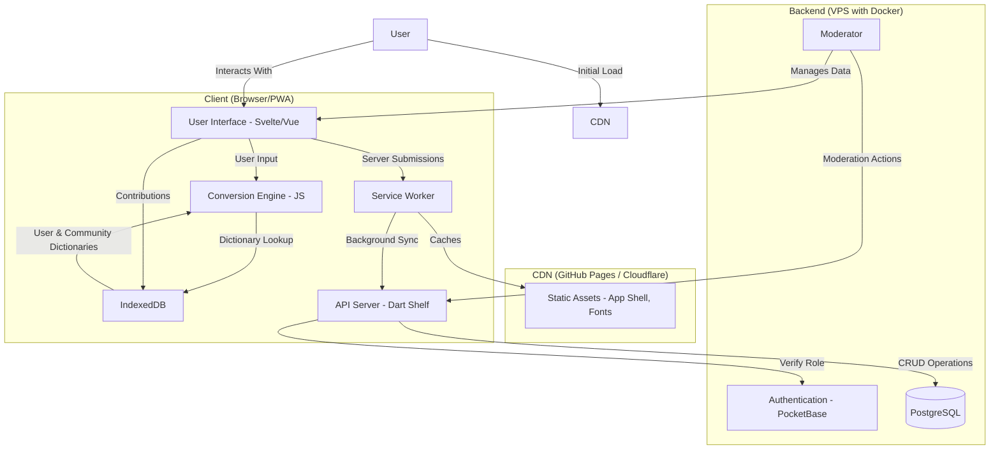
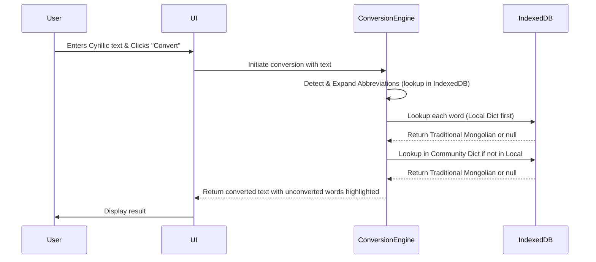
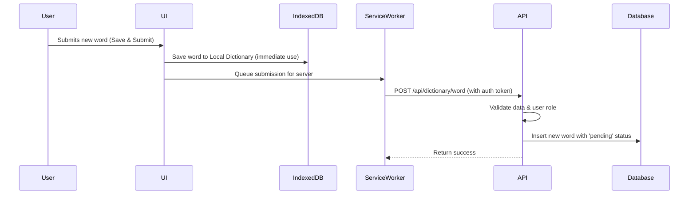

# Cyrillic-Traditional Mongolian Converter: Technical Specification

This document outlines the technical specifications for the Cyrillic-Traditional Mongolian Converter PWA. It serves as the primary technical reference for all development tasks.

## 1. System Architecture

### 1.1. Overview

The system is a Progressive Web App (PWA) with a hybrid backend. The core design principles are **privacy-first** and **offline capability**. All text conversion happens on the client-side, and no user text is ever uploaded to a server. The backend exists solely to manage the crowdsourced dictionary and the moderation system.

### 1.2. High-Level Architecture Diagram



### 1.3. System Components

*   **Frontend PWA**: A single-page application containing all UI, client-side conversion logic, and local dictionary management in IndexedDB.
*   **Service Worker**: A background script enabling offline functionality, application shell caching, and background synchronization of the community dictionary.
*   **Backend API (Dart Shelf)**: A stateless API for ingesting new word contributions, managing the moderation workflow, and serving dictionary updates.
*   **Authentication Service (PocketBase)**: Manages user registration, login, and roles (e.g., "user," "moderator").
*   **Database (PostgreSQL)**: The source of truth for all community-contributed words, abbreviations, and moderation logs.

### 1.4. Data Flow Diagrams

#### Conversion Flow (Client-Side Only)



#### Contribution Sync Flow



## 2. Technology Stack

*   **Frontend Framework**: SvelteKit or Vue.js (Chosen for performance and small bundle sizes).
*   **Frontend Styling**: Tailwind CSS (For a utility-first, responsive UI).
*   **Frontend Build Tool**: Vite.
*   **Client-Side Storage**: IndexedDB (For user and community dictionaries).
*   **Backend API**: Dart 3+ with the Shelf framework.
*   **Authentication**: PocketBase (Self-hosted).
*   **Database**: PostgreSQL 15+.
*   **Containerization**: Docker and Docker Compose.
*   **Hosting**:
    *   **Frontend**: GitHub Pages with Cloudflare CDN.
    *   **Backend**: VPS (e.g., DigitalOcean, Hetzner) running Docker containers.

## 3. Feature Specifications

### 3.1. Core Conversion & Contribution

*   **Acceptance Criteria**:
    *   Conversion must happen entirely client-side in under 500ms for typical text.
    *   Unconverted words remain in Cyrillic and are highlighted with a red dotted underline.
    *   Clicking a highlighted word opens a contribution modal showing context (2 words before/after).
    *   User contributions are saved to their local IndexedDB dictionary immediately for personal use.
*   **Technical Requirements**:
    *   A Menksoft-to-Unicode conversion algorithm must be implemented in JavaScript for the copy-to-clipboard action.
    *   Abbreviation detection (`/\b[A-Z-]{2,}\b/g`) runs before the main word-by-word conversion.
*   **Implementation Approach**:
    1.  On app load, dictionaries are loaded from IndexedDB into in-memory JavaScript `Map` objects for O(1) lookup performance.
    2.  The conversion process first expands abbreviations, then splits text into words.
    3.  Each word is looked up, prioritizing the User Map, then the Community Map.
    4.  Unconverted words are wrapped in a `<span>` with a class for styling and event listeners.
*   **Error Handling**:
    *   **Offline Submission**: The Service Worker's Background Sync API will be used to queue submissions made while offline.
    *   **Large Text (>5000 words)**: Conversion logic will be offloaded to a Web Worker to prevent blocking the main UI thread.

### 3.2. User Authentication & Moderation

*   **Acceptance Criteria**:
    *   Logged-in users can apply for moderation by passing a 10-question test with a score of 9/10 or higher.
    *   Moderators can review pending submissions in a blind review process (contributor and other votes are hidden).
    *   An approval adds +1 to a word's score; a rejection adds -1.
*   **Technical Requirements**:
    *   All moderation API endpoints must be protected, requiring a valid JWT from a user with a 'moderator' role.
    *   The 10 test questions for the moderator application must be fetched from a secure endpoint.
*   **Implementation Approach**:
    *   Authentication is handled by the PocketBase Web SDK, which provides a JWT.
    *   The JWT is sent in the `Authorization: Bearer <token>` header on all API requests.
    *   The Dart API uses a middleware to validate the JWT and check the user's role.
    *   Status changes based on `approval_count` are handled atomically on the backend:
        *   `approval_count >= 1`: status = `probation`
        *   `approval_count >= 5`: status = `accepted`
        *   `approval_count <= -3`: status = `rejected`
*   **Error Handling**:
    *   **Race Conditions**: Database transactions with `SELECT FOR UPDATE` will be used to lock rows during approval count updates to prevent race conditions.
    *   **Unauthorized Access**: The API will return a `403 Forbidden` status code for unauthorized access attempts.

## 4. Data Architecture

### 4.1. Data Models (PostgreSQL)

#### `WordConversionPairs`
Stores the core translation data.
```sql
CREATE TABLE WordConversionPairs (
    word_id BIGSERIAL PRIMARY KEY,
    cyrillic_word TEXT NOT NULL,
    traditional_mongolian_menksoft TEXT NOT NULL,
    traditional_mongolian_latin TEXT NOT NULL,
    context_before TEXT,
    context_after TEXT,
    status VARCHAR(10) NOT NULL DEFAULT 'pending', -- 'pending', 'probation', 'accepted', 'rejected'
    approval_count INTEGER NOT NULL DEFAULT 0,
    contributor_id VARCHAR(30) NULL, -- FK to PocketBase users.id
    contributor_ip_hash VARCHAR(64) NULL,
    created_at TIMESTAMPTZ NOT NULL DEFAULT NOW(),
    updated_at TIMESTAMPTZ NOT NULL DEFAULT NOW()
);
CREATE INDEX idx_cyrillic_word ON WordConversionPairs (cyrillic_word);
CREATE INDEX idx_status ON WordConversionPairs (status);
```

#### `AbbreviationExpansions`
Stores abbreviation definitions. Schema is analogous to `WordConversionPairs`.

#### `ModeratorActions`
Logs every moderation action for auditing.
```sql
CREATE TABLE ModeratorActions (
    action_id BIGSERIAL PRIMARY KEY,
    word_id BIGINT NULL REFERENCES WordConversionPairs(word_id),
    abbreviation_id BIGINT NULL, -- REFERENCES AbbreviationExpansions(abbreviation_id)
    moderator_id VARCHAR(30) NOT NULL, -- FK to PocketBase users.id
    action_type VARCHAR(10) NOT NULL, -- 'approve', 'reject', 'edit'
    timestamp TIMESTAMPTZ NOT NULL DEFAULT NOW()
);
```

#### `ModeratorApplications`
Tracks applications to become a moderator.
```sql
CREATE TABLE ModeratorApplications (
    application_id SERIAL PRIMARY KEY,
    user_id VARCHAR(30) NOT NULL,
    test_score INTEGER NOT NULL,
    test_answers JSONB,
    self_description TEXT,
    status VARCHAR(10) NOT NULL DEFAULT 'pending', -- 'pending', 'approved', 'rejected'
    created_at TIMESTAMPTZ NOT NULL DEFAULT NOW()
);
```

#### `Users` (PocketBase Collection)
*   Managed by PocketBase.
*   Custom Field: `is_moderator` (boolean, default: `false`).

### 4.2. Data Storage & Caching

*   **Client-Side**: Two IndexedDB object stores: `userDictionary` and `communityDictionary`, keyed by `cyrillic_word`.
*   **Server-Side Caching**: The gzipped full dictionary file is pre-generated and cached on the server to avoid generating it on every request.

## 5. API Specifications

### `POST /api/dictionary/word`
*   **Description**: Submit a new word contribution.
*   **Auth**: Optional.
*   **Rate Limiting**: 10/hr for anonymous IPs, 60/hr for authenticated users.
*   **Request Body**:
    ```json
    {
      "cyrillic_word": "Монгол",
      "traditional_mongolian_latin": "monggol",
      "context_before": "Би бол",
      "context_after": "хүн."
    }
    ```
*   **Response (201 Created)**:
    ```json
    { "status": "success", "message": "Contribution received." }
    ```

### `GET /api/dictionary/full`
*   **Description**: Download the complete, gzipped community dictionary.
*   **Auth**: None.
*   **Response**: A `application/gzip` file containing a JSON array.
    ```json
    [{ "c": "Монгол", "t": "menksoft_encoding" }, ...]
    ```

### `POST /api/moderation/word/{id}/approve`
*   **Description**: A moderator approves a word.
*   **Auth**: Required (moderator role).
*   **Response (200 OK)**:
    ```json
    {
      "word_id": 12345,
      "new_approval_count": 1,
      "new_status": "probation"
    }
    ```

### `POST /api/moderation/word/{id}/reject`
*   **Description**: A moderator rejects a word.
*   **Auth**: Required (moderator role).
*   **Response (200 OK)**:
    ```json
    {
      "word_id": 12345,
      "new_approval_count": -1,
      "new_status": "pending"
    }
    ```

## 6. Security & Privacy

### 6.1. Authentication & Authorization
*   **Mechanism**: JWTs issued by PocketBase are included in the `Authorization: Bearer <token>` header for all API calls.
*   **Roles**:
    *   **Anonymous**: Can convert, download dict, submit words (rate-limited).
    *   **Authenticated User**: Can apply for moderation and view their contribution history.
    *   **Moderator**: Can access the moderation dashboard and all moderation endpoints.

### 6.2. Data Security
*   **Encryption**: All traffic is encrypted via TLS 1.2+ (HTTPS). Passwords are hashed at rest by PocketBase.
*   **PII Handling**: The only PII collected from anonymous users is the IP address, which is **hashed with SHA-256** before being stored. Raw IP addresses are never stored.

### 6.3. Application Security
*   **Input Validation**: All user-submitted text is sanitized on the backend before database insertion to prevent XSS.
*   **SQL Injection**: All database queries use parameterized statements.
*   **Security Misconfiguration**: Strict CORS policies and security headers (`Content-Security-Policy`, etc.) are enforced by the reverse proxy and backend API.